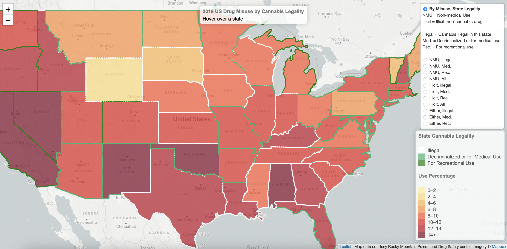
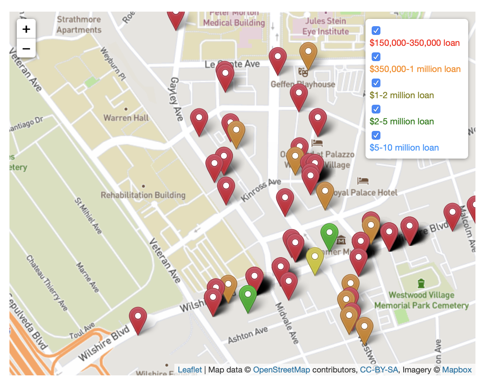
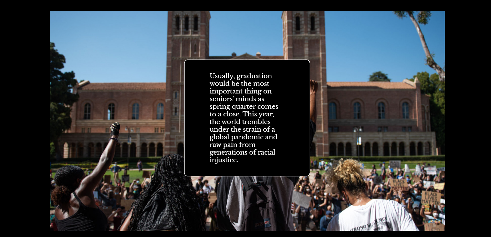
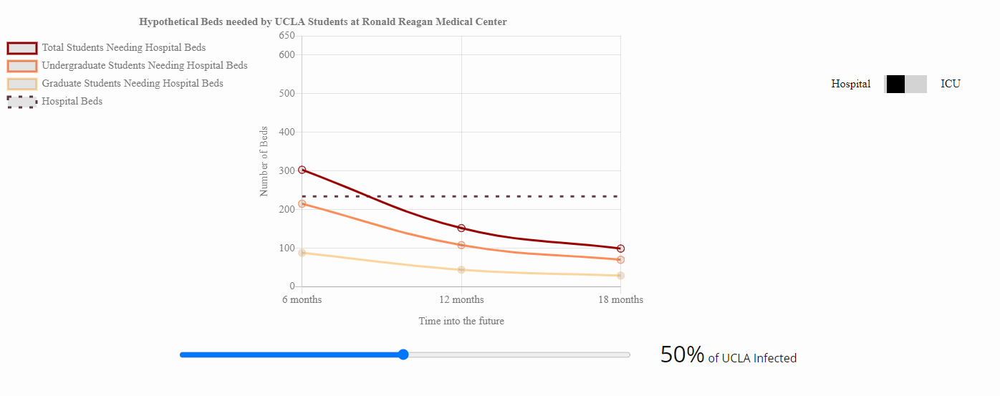
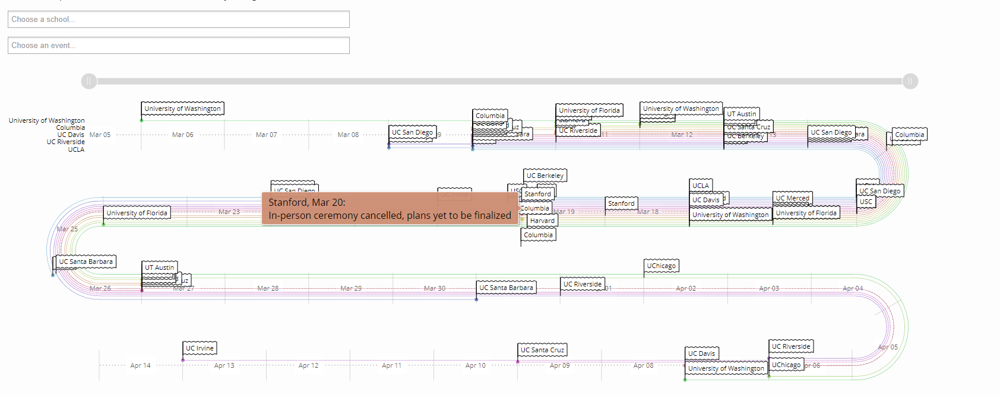
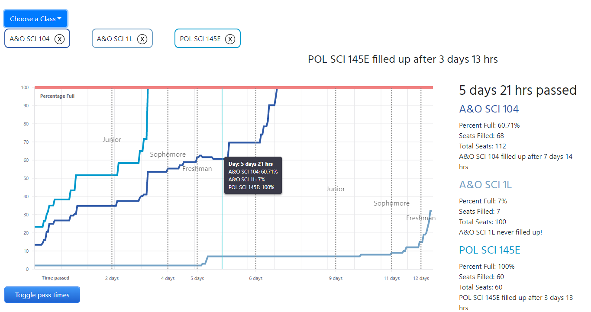
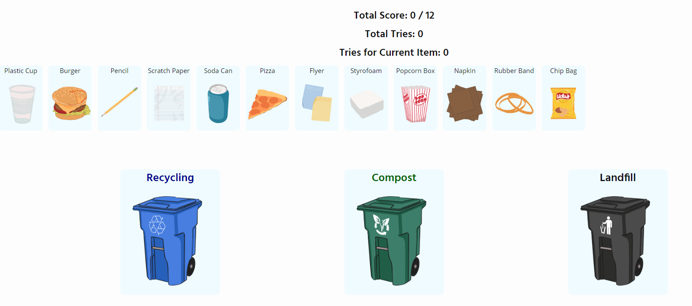
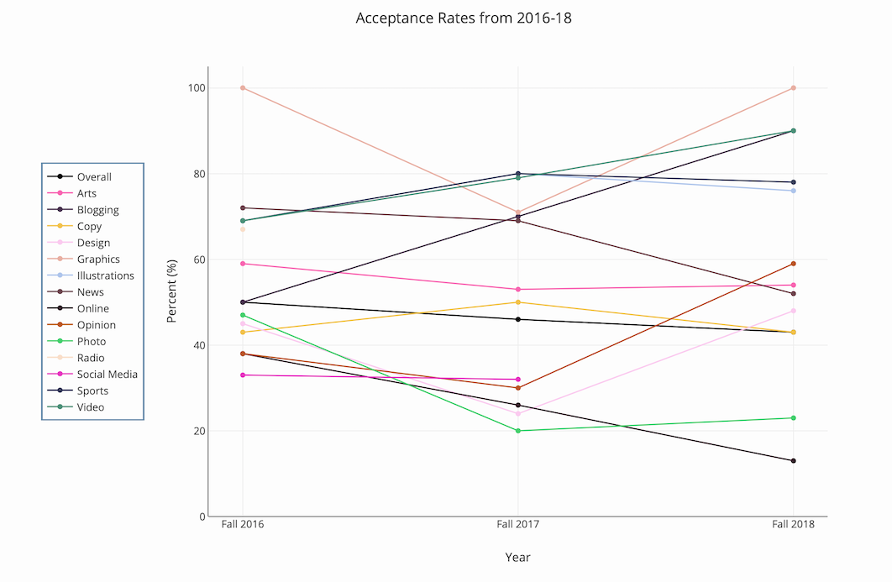
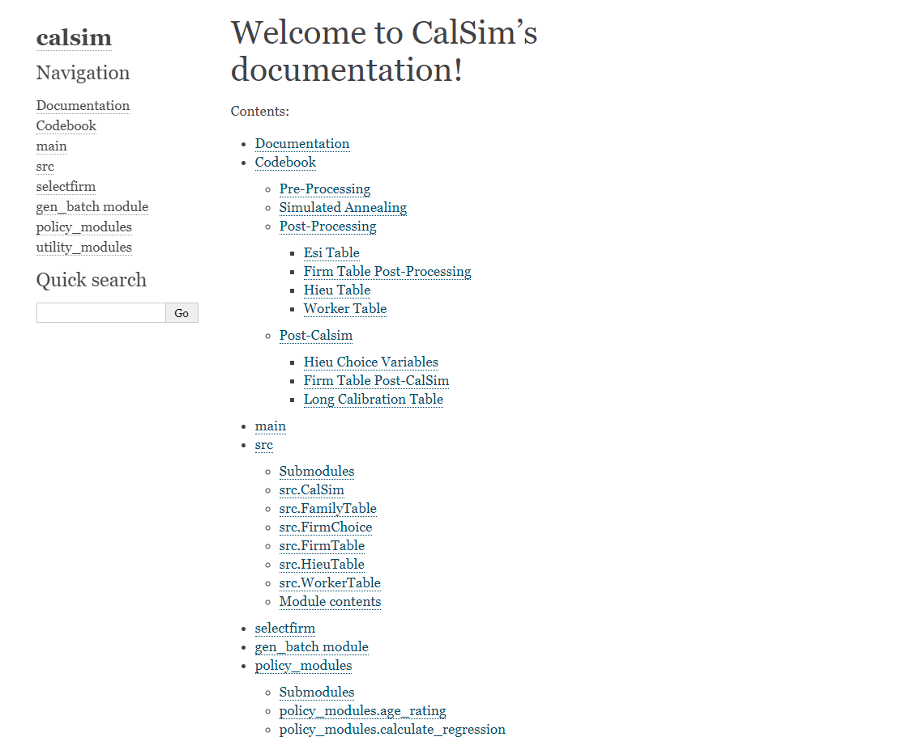
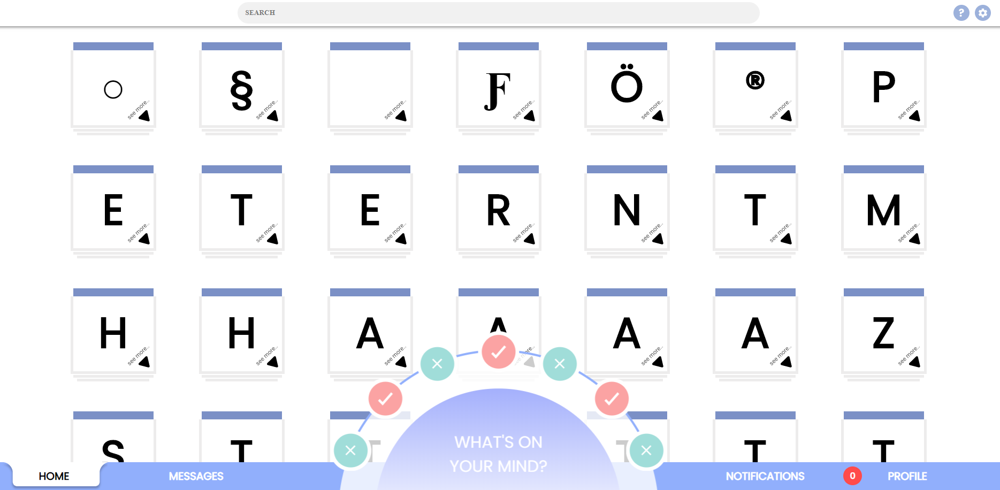

# Projects

# UCLA Datafest

## [2019 US State Drug Misuse by Cannabis Legality](https://benohrbrill.com/datafest/)

Categorized levels of drug misuse by level of cannabis legality in US states, winning [Best Visualization](http://datafest.stat.ucla.edu/competition/2021-asa-datafesttm-results/) prize in annual UCLA Statistics competition and third place prize in the ISI Florence Nightingale for Data Visualization competition

# The Stack

### The data journalism section of the _Daily Bruin_, UCLA's student newspaper

## [Paycheck Protection Program Westwood Businesses Map](https://dailybruin.com/2020/09/05/the-quad-the-paycheck-protection-program-and-how-it-has-affected-westwood-businesses)

Mapped which Westwood, LA businesses receiived a loan greater than 150k from the federal Paycheck Protection Program.

## [Scrollytell for 2020 UCLA Graduation Issue](https://gradissue2020.dailybruin.com/)

Created scrolly telling animation at the start of the page as well as the sidebar post-scrollytelling.

## [Visualizing Los Angeles Hospitals, and Simulating COVID-19 on an Unprotected UCLA](https://stack.dailybruin.com/2020/04/20/covid-hospitals/)

Graphed the amount of hospital and ICU beds potentially needed by the Ronald Reagan Medical Center by UCLA according to predictions from Harvard researchers.

## [School's Out, Zoom's In](https://stack.dailybruin.com/2020/04/15/covid-collegecompare/)

Created a timeline of several US colleges' responses to COVID-19 during its spring outbreak. Allowed users to filter the timeline by school and major event.

## [How Quickly do Classes Fill up](https://stack.dailybruin.com/2020/02/05/class-fill-ups/)

Scraped how quickly every class at UCLA fills up during Winter 2020 enrollment. Created an interactive chart that allows users to compare how fast their classes fill up. Also created charts showing the amount of classes that fill up per department. Built using React, react-bootstrap, and react-vis.

## [UCLA Trash Breakdown](https://stack.dailybruin.com/2019/06/07/waste-audits/)

Analyzed how much students/faculty at UCLA compost and recycle vs. throw trash into the landfill bin. Includes an interactive game where you try to sort different types of trash into the correct waste bin. After you are done with the game, compare the number of tries you took with other people who played the game! Built using flask, React, and d3.

## [Analysis of the _Daily Bruin_'s 2018 Fall Interns](https://stack.dailybruin.com/2018/12/10/2018db-recruitment/)

Looked at the accpetance rates and demographics of the _Daily Bruin_'s 2018 fall interns. Play around with the interactive graphs and charts!

# UCLA Tau Beta Pi Website

### Engineering Honors Society of UCLA

## [TBP Website](https://tbp.seas.ucla.edu/)

Manage and update the Tau Beta Pi website. Handle the tutoring schedule, officers page, database errors, email errors, and a variety of other things.

# In-person Class Tracker

## [Google Drive Link](https://drive.google.com/file/d/11_3r7lAqQArxirPWKR1BtPTkB_epecEc/view?usp=sharing)

A tracker that was made to track in-person classes for international students in response to the Trump's administration proposed plan to strip visas of students with no in-person classes. Automated a script that checked which Fall 2020 UCLA classes were in-person and how much space they had left. The script would automatically upload and format the data to a public Google Drive folder.

# CalSIM

### My UCLA Center for Health Policy Research intern project during the spring, summer, and fall of 2019.

## [CalSIM documentation page](https://calsim.bitbucket.io)

Amongst other private tasks, I rehauled the entire documentation page for CalSIM, and created a bash script to easily update it. Built using Sphinx and bash.

# Flux

### A project I created with a team of classmates and friends for Creative Labs, a CS project club at UCLA

## [flux.rip](https://flux.rip)

#### [Github link](https://github.com/UCLA-Creative-Labs/flux/wiki)

This social media website was intentionally designed to have poor UX (to teach others about why good UX is important!). You can do everything you can normally do on social media sites: friend people, upload posts, view others' posts, recieve notifications, and send messages, but everything comes with a twist. When you try logging in, slide the continue button all the way to the left, then manually drag the progress bar to 100%. This should get you to the main site where you'll see all other sorts of UX problems in store for you! Built using React and firebase.
